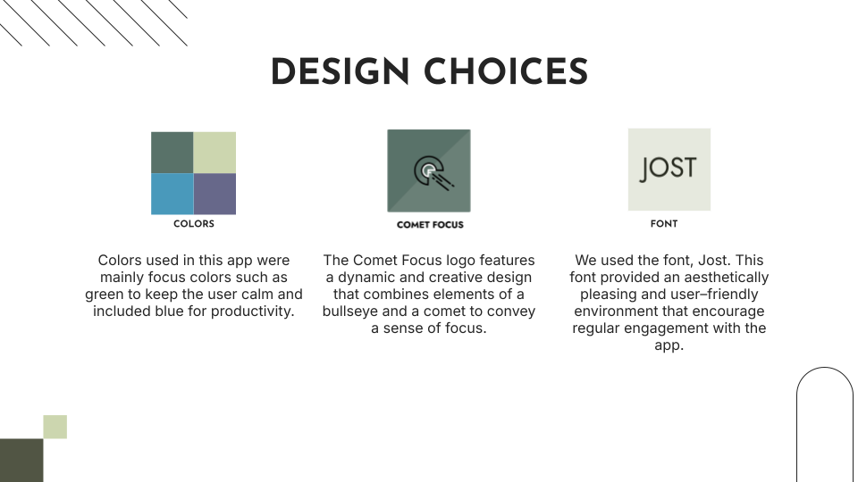

<h1>Comet Focus ☄️</h1>

I was tasked with researching academic procrastination in a UTD course in order to design a mobile app to help alleviate the problem. This is the generative research report I have gathered from the various research methods I conducted.

<h2>📑 Generate Research Report</h2>

<h3>The Segment of Interest</h3>

Click here to read

We are going to design a mobile app for students at The University of Texas at Dallas. This app will assist students in dealing with procrastination and help them finish their schoolwork. According to secondary research, data collected from college students in studies indicated that stressful life events, smartphone addiction, and the fear of failure are potential signs that lead to procrastination. Furthermore, interviews with UTD students pointed out that lack of motivation, laziness, and lack of interest are contributors to procrastination. These are some things to consider about the possible users when designing the app.

<h3>Statement of the Problem</h3>

Click here to read

When UTD students are assigned work for their classes, many of them will procrastinate on the various tasks. According to a focus group consisting of nine ATEC major UTD students, all nine had problems with procrastination in the last year. In addition to that, two UTD students who were interviewed claimed that they were procrastinating recently. This problem has affected the students in some way. For example, three interviewed UTD students claimed that procrastination had cost them good grades. A research study, “The Positive and Negative Aspects of Procrastination in College Students” by Fanzhi Zhu, has also stated that procrastination can significantly hinder college students' academic performance.

It is clear that procrastination is a problem for many college students. UTD students will deal with it in different ways. One interviewed participant dealt with procrastination by getting motivated. Participant two would try to do an easier task first, and participant three would turn everything off. What the three participants have in common is that they could deal with procrastination on their own. If there were a tool that could assist them with this issue, ⅔ participants stated that they would be willing to use it. Therefore, we want to help UTD students by creating a mobile application that helps these students deal with this problem. We hope that the app can allow students to do their work efficiently so that they can increase productivity and performance. 

<h3>Empathy Map</h3>

<h3>Design Persona</h3>

  

<h3>Future State User Journey</h3>

<h3>Recommendations</h3>

Click here to read

<h4>Recommendation 1</h4>

<em>Provide a To-Do list and calendar where users can input assignment due dates and know what tasks to do on a certain day. The app would remind users by sending a notification on their phone about upcoming assignments.</em>

In a focus group, it was mentioned that due dates and adrenaline can be motivators to get started on work. Participant 1 in the interview has also stated that a deadline serves as a motivator and driver. Since due dates can act as a motive, a reminder about assignment dates from the app can give users a push to get started. Furthermore, forgetting to do tasks was mentioned in a focus group and by Participant 3 in the interview. Having a list and calendar can help users remember what to do and keep things organized. 

<h4>Recommendation 2</h4>

  <em>
  Provide a Pomodoro timer as the main feature when users are doing a task. The timer doesn’t have to be set at 25 minutes, but can be adjusted to the user’s preference. Also, the break timer can be adjusted within 15 minutes, and users can set the number of Pomodoro cycles.
  </em>

  In “The influence of stressful life events on procrastination among college students: multiple mediating roles of stress beliefs and core self-evaluations” study, a potential cause of procrastination can be stress. When working, taking breaks can allow people to recharge and reset. A Pomodoro or work timer can be effective because it gives users a consistent work and break schedule. Having a little break after hard work might reduce stress levels. It was also mentioned in “The Positive and Negative Aspects of Procrastination in College Students” that taking breaks can help students overcome negative procrastination.

<h4>Recommendation 3</h4>

  <em>Recommendation: Provide a mode that locks the phone during the work timer. During the timer, users will not be able to use their mobile phones until the break phase or after completing the cycle.</em>

According to “The Mediating Roles of Time Management and Learning Strategic Approach in the Relationship Between Smartphone Addiction and Academic Procrastination”,  smartphone addiction has a positive correlation with academic procrastination. Additionally, a focus group mentioned that social media and YouTube were some distractions when working on an assignment. To combat this, locking the phone during the timer can reduce a source of distractions. It can make the user focus on their work with more attention and eliminate addiction. 

<h2>🧩 Putting it all together</h2>

After doing our individual research, I was placed in a team to put everything together and design the mobile app. My team and I designed the look and feel of the app Comet Focus. I worked on feature 2 of the app, which is the pomodoro timer. Here are the slides that my group presented at the end of the course. It includes the purpose of the project, wireframes for each feature, research that supported the features, and the overall design choices. 

<h3>Group Members</h3>

<ul>
  <li>Jair - Overall Design</li>
  <li>Lexi - Feature 1</li>
  <li>Philip - Feature 2</li>
  <li>Chinwe - Feature 3</li>
</ul>

<h2>Wireframes</h2>

<h3>Syllabus Scanner</h3>

<h3>Pomodoro Timer</h3>

<h3>Study Groups</h3>

<h3>Design Choices</h3>

<h2>🎤 Presentation</h2>

Check out our <a href="https://github.com/FaiLuReH3Ro/comet-focus/blob/main/Comet%20Focus.pdf">full presentation</a> to see more details of the final project.

